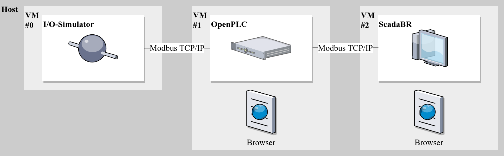
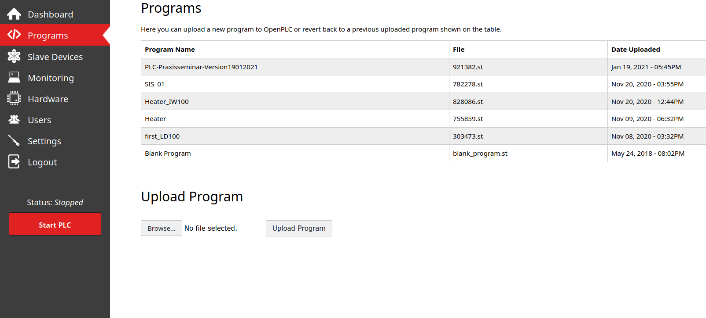
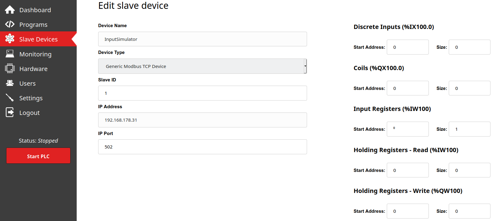
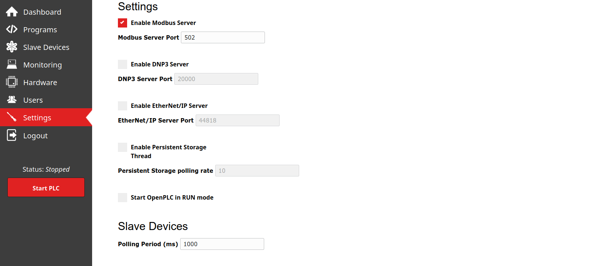

# DigitalTwin-ScurityTesting

The following screenshot outlines the BoilerICS-DigitalTwin. The digital twin simulates an industrial control system (ICS) securing a boiler against failure caused by increasing pressure isnide the boiler. It consists of a PLC, a HMI and an input/output - simulator hosted in seperate virtual maschines. The components communicate using the modbus TCP protokoll.

# Installation

It is possible to run the digital twin on one operating system alone, but to approximate a real system environment we split up to components over three different virtual maschines.

To Setup the digital twin properly follow the given instructions below.

### Install VirtualBox

To install VirtualBox visit https://www.virtualbox.org/. Click the download tab and choose a version depending on your operating system. 

In the next step setup two virtual maschines. Specific instructions to create a virtual maschine are given here https://www.virtualbox.org/wiki/Documentation.

Our Approach uses windows 10 to run the input/output-simulator due to the best compatibility. To host the openplc runtime we use ubuntu linux. ScadaBR uses an specific virtual maschine image, further informations are given below.

### Install OpenPLC

To install and setup the openplc runtime visit https://www.openplcproject.com/. Click the getting started tab and follow the instructions to install the openplc runtime.

### Install ScadaBR

To install and setup ScadaBR in a virtual maschine visit https://www.openplcproject.com/. Click the getting started tab and follow the instructions to install the ScadaBR HMI.

### Install Input/Output-Simulator

There are many different modbus tcp simulators out in the internet that can be used for our purposes, for the best usability we recommend http://easymodbustcp.net/modbus-server-simulator.

# Configuration

### OpenPLC runtime

After installing and starting the runtime visit localhost:8080 to open the user interface.

First click on the programs tab and upload the boiler.st file.

Next click on the slave devices tab and enter the following settings. The ip address should be the address of your virtual maschine where your input/output-simulator is running.

Last click on the settings tab to do some small changes here also.

### Input/Output-Simulator

### ScadaBR HMI

